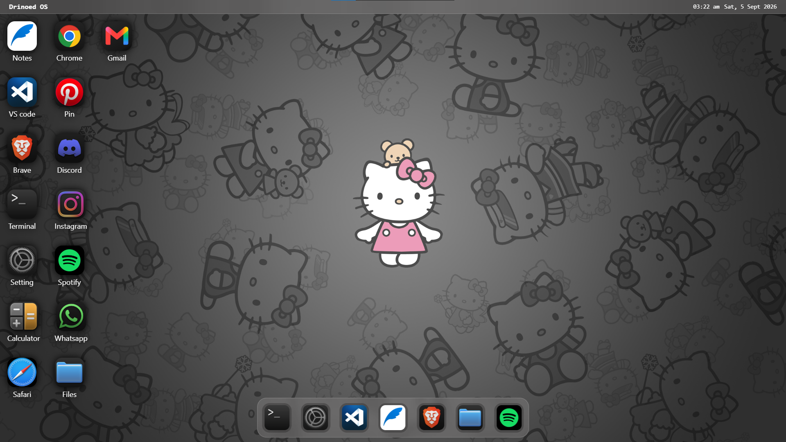

# Drinoed OS

A fun little desktop OS that runs entirely in your browser — built with just HTML, CSS, and JavaScript. No frameworks, no build tools, no installs.

## Screenshots

  
  
  
  
  

## Tech Stack

Just vanilla **HTML5**, **CSS3**, and **JavaScript (ES6+)** — no dependencies.

## Live demo
https://web-os-1-rho.vercel.app/

<<<<<<< HEAD
Feel free to use, modify, and share.
=======
Feel free to use, modify, and share.
>>>>>>> 77cbdf59ac9e0cc99bd98228aca257de8be107e3
